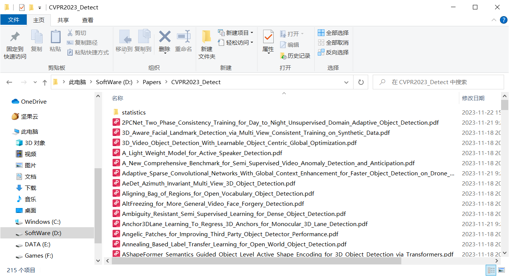

# Crawling-and-Analyzing-CV-Conference-Papers

## Introduction

从顶会上抓取计算机视觉论文的Python代码。目前支持CVPR、ICCV、ECCV、NeurIPS、ICML、ICLR（2020以后）。它利用网站测试框架selenium从会议网站抓取标题和pdf网址，并通过一些简单的反抓取技巧下载论文。

旧会议的网站不能保证没有漏洞，因为这个项目是基于最新的网站架构。

爬取结果展示



词云展示：来自CVPR2023和ICCV2023的论文标题数据


## Requirements

仅下载论文

```
pip install selenium, slugify, pandas
```
分析论文（进行词频统计和词云显示）

```
pip install matplotlib, wordcloud
```

本项目使用的配置信息

```
# 操作系统
win10
# python库的版本
selenium                      4.15.2
wordcloud                     1.9.2
Pillow                        9.3.0
matplotlib                    3.5.1
```

如果wordcloud报错找不到字体，大概率是pillow版本的问题。

## Function

1. 爬取会议论文，可以根据关键词爬取特定领域的论文。
2. 对论文的标题进行词频统计并绘制词云图

## 下载论文

使用download.py下载论文，填入正确的参数

```python
conference = 'cvpr'
year = "2023"
conference_url = "https://openaccess.thecvf.com/CVPR2023?day=all"  # the conference url to download papers from
subjcet = "Detect"                                              # 论文主题
patterns = ["Detect", "DETR", "RCNN", "YOLO"]                   # 要检测的关键字, 全下载则不填: patterns = []
root = (r'D:\Papers\CVPR2023_' + subjcet).replace('\\', '/')    # 设置本次下载的目录
statistics_root = os.path.join(root, "statistics")              # 存放统计信息（图表）目录
num_threads = 8    											# 进程数
```

参数详解：

|      参数       |         解释         |                             用法                             |
| :-------------: | :------------------: | :----------------------------------------------------------: |
|   conference    |        会议名        |                     大写会议简称，例CVPR                     |
|      year       |       会议年份       |                           例 2023                            |
| conference_url  |       会议链接       |              会议论文页链接，查下面的链接表获得              |
|     subjcet     |    爬取的论文主题    |             要爬的论文的主题，爬取全部建议填ALL              |
|    patterns     | 要爬取的论文的关键字 | 会查询论文标题是否包含关键字，包含的则下载，根据领域的关键词填写。如果全部爬取则设置这个list为空。 |
|      root       |    下载论文的位置    |  填写你想存放的位置，默认位置是 D:\Papers\会议+年份+subjcet  |
| statistics_root |  统计数据存放的位置  | 保存两个excel表格，分别是会议的全部论文表和当前主题论文表，statistics_root是这两张表存放的文件夹，默认是root下的statistics文件夹 |
|   num_threads   |       进程数量       |       默认设置8个进程，实际使用中多进程爬完电脑容易卡        |

如果想要爬取其他网站，需要在`retrieve_titles_urls_from_websites.py`写一个检索函数，这个函数需要返回论文题目和论文url链接。

下面是论文连接的样例列表，根据想下载的会议去选择对应链接和会议名，同时年份也要保持正确。

### NIPS会议链接

只需要修改年份以及url即可

```python
conference_url = "https://papers.nips.cc/paper/2022"  # 2022
conference_url = "https://papers.nips.cc/paper/2021"  # 2021
conference_url = "https://papers.nips.cc/paper/2020"  # 2020
```

### CVPR会议链接

```python
# CVPR2023
conference_url = "https://openaccess.thecvf.com/CVPR2023?day=all"
# CVPR2022
conference_url = "https://openaccess.thecvf.com/CVPR2022?day=all" 
# CVPR2021
conference_url = "https://openaccess.thecvf.com/CVPR2021?day=all"
# CVPR2020
conference_url = "https://openaccess.thecvf.com/CVPR2020"
# CVPR2019
conference_url = "https://openaccess.thecvf.com/CVPR2019"
```

### ICCV会议链接

```python
# ICCV2023
conference_url = "https://openaccess.thecvf.com/ICCV2023?day=all"  
# ICCV2021
conference_url = "https://openaccess.thecvf.com/ICCV2021?day=all"
```

### ECCV会议链接

注：ECCV会出现论文数量和题目不一致的情况，可能是页面加载不完全，我在检索论文的时候等待了4s来解决问题。

ECCV2022

```python
# ECCV会议的论文年份是必须正确的
# ECCV2022
year = "2022"
conference_url = "https://www.ecva.net/papers.php" 
# ECCV2020
year = "2020"
conference_url = "https://www.ecva.net/papers.php"
```

### ICML会议链接

```python
conference_url = "http://proceedings.mlr.press/v202/" # ICML 2023
conference_url = "http://proceedings.mlr.press/v162/" # ICML 2022
conference_url = "http://proceedings.mlr.press/v139/" # ICML 2021
conference_url = "http://proceedings.mlr.press/v119/" # ICML 2020
```

### ICLR会议链接

网速过慢可能会爬取失败, 需要调节代码里的等待时间（应该有更好的实现方式）

```python
# ICLR 2023
conference_url = "https://openreview.net/group?id=ICLR.cc/2023/Conference"
# ICLR 2022
conference_url = "https://openreview.net/group?id=ICLR.cc/2022/Conference"
# ICLR 2021
conference_url = "https://openreview.net/group?id=ICLR.cc/2021/Conference"
# ICLR 2020
conference_url = "https://openreview.net/group?id=ICLR.cc/2020/Conference"
```

## 分析论文

根据论文题目，统计词频和绘制词云：使用analyse.py进行分析

参数填写

```python
paper_list_roots = ["D:\Papers\ECCV2022_Detect\statistics\eccv2022_all.xlsx",
                       "D:\Papers\CVPR2022_Detect\statistics\cvpr2022_all.xlsx"]    # 根目录
stop_words_root = "./supports/stop_words.txt"           # 停止词, 没有可以不填
save_root = "D:\Papers\statistics"                      # 词频和图片保存路径
frequencies_filename = "ALL_CV2022WordFrequency.xlsx"       # 保存词频的文件名
wordcloud_filename = "ALL CV2022 Word Cloud"                # 保存词云图的文件名
```

paper_list_roots： 填写要分析的excel表，表中有论文的题目。

save_root：词频表和词云图的保存路径

frequencies_filename, wordcloud_filename分别是词频和词云图的文件名。

## Errors

### 发生 SSLError等 : 重新RUN

因为网络问题等原因可能会发生SSL Error等导致下载停止，重新run就能继续下载。

### 论文爬取错误-不全、不对应

删除论文下载目录下的statistics文件夹，然后重新运行。


## To-do List

- [ ] 修改潜在的bugs, 上述写了的会议链接都测试过，但代码经过几次修改后没有全部重新测试，如有bug可issue反馈。
- [ ] 更新README，写一个更详细的README。
- [x] 增加论文分析的功能--对比前后关键词数量变化，方便看出领域的发展趋势。

## Thanks

**感谢项目**: [seanywang0408/Crawling-CV-Conference-Papers](https://github.com/seanywang0408/Crawling-CV-Conference-Papers) 

本文的项目是基于上述上面开发和修改的。

**爬完论文后想知道哪些论文是重要的?**可以看下面的项目来了解哪篇论文的github:star:数目多：

[yzfly/CVPR2023_Top_Open_Papers:  [Paper + Code\].🔥 (github.com)](https://github.com/yzfly/CVPR2023_Top_Open_Papers) 


